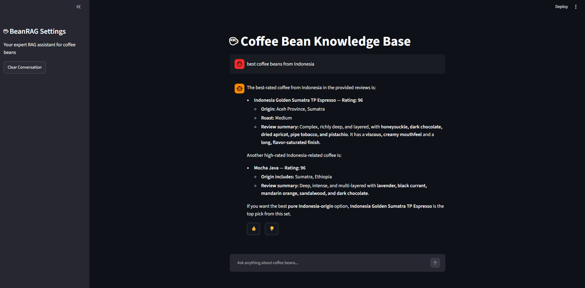
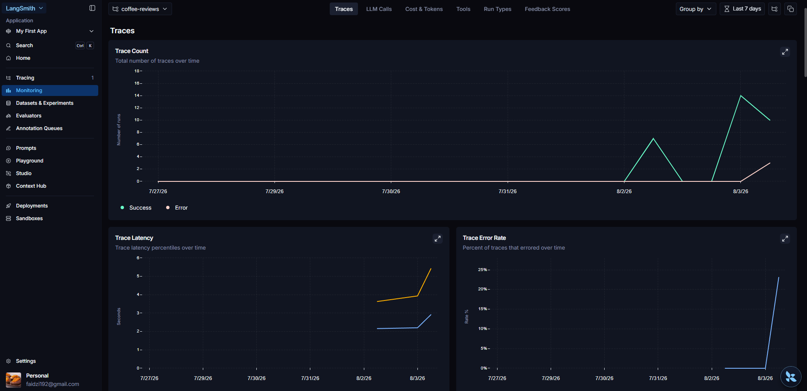
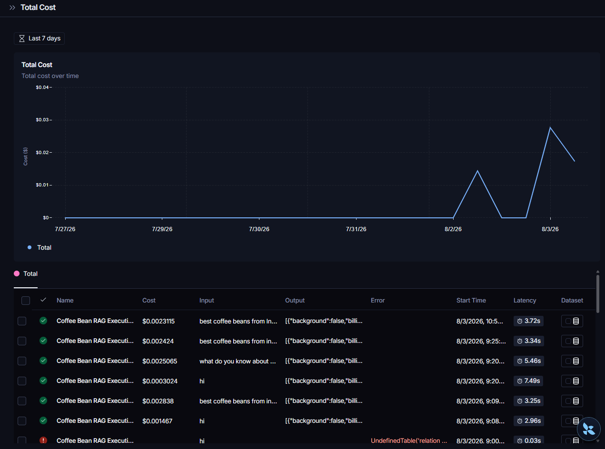

# ☕ Coffee Bean RAG Assistant

## What is this about?

A Retrieval-Augmented Generation (RAG) application built on a [coffee bean review dataset](https://www.kaggle.com/datasets/schmoyote/coffee-reviews-dataset) as its knowledge base. The project helps users **find the best coffee beans for their needs** and provides **personalized recommendations** based on their preferences.

## Tech Stack

| Technology | Role |
|---|---|
| **OpenAI LLM** | Powers the AI agent model |
| **PGVector** | Vector database for storing and retrieving embeddings |
| **ONNX Embedder** | Using 'all-MiniLM-L6-v2' for text-to-vector embedding|
| **Streamlit** | Simple chatbot-style user interface |
| **LangSmith** | Tracing and monitoring application usage |

## Building the Knowledge Base

Two retrieval approaches were evaluated for the knowledge base: **text search** and **vector search**.

### Evaluation Method

Using an **LLM-as-judge** approach, the LLM scored each retrieved context as:
- `1` — relevant
- `0` — irrelevant

The evaluation set consisted of 30 LLM-generated questions (mimicking real user queries), each paired with 5 retrieved contexts — **150 contexts evaluated in total**.

### Results

| Method | Hit Rate | MRR | Precision |
|---|---|---|---|
| Vector Search | 1.0000 | 0.9624 | 0.8839 |
| Text Search | 0.9667 | 0.8944 | 0.7800 |

**Vector search outperformed text search across all metrics** and was selected as the retrieval method for the knowledge base.

### Context Relevance Judge Prompt

```
You are an expert evaluator assessing the relevance of retrieved context chunks for a search engine.

User Query:
"{query}"

Retrieved Context Chunk:
"{context}"

Task:
Evaluate whether the retrieved context contains relevant information that directly addresses, answers, or satisfies the user query (e.g., matching requested roast, origin, price, rating, or tasting notes).

Scoring Criteria:
- Score 1 (RELEVANT): The context contains information that directly matches or satisfies the query constraints or intent.
- Score 0 (IRRELEVANT): The context is off-topic, contradicts the query, or lacks the key attributes requested.
```

## Evaluating the Generated Answers

Good retrieved context alone isn't enough — the **generated response** also needs to be evaluated. A separate AI agent acted as a judge to assess answer quality against the prompt below.

### Answer Generation Prompt

```
You are a precise coffee review analysis assistant. Your sole function is to answer user queries using exclusively the retrieved coffee review context provided below.

---
### Context Schema
The retrieved context will consist of data entries with the following schema:
* **name**: Name of the coffee blend/single origin.
* **roast**: Roast profile (Light, Medium-Light, Medium, Medium-Dark, Dark).
* **loc_country**: Country where the roaster is located.
* **origin_1**: Origin location of the coffee beans.
* **origin_2**: Second origin location of the coffee beans.
* **rating**: Score or rating assigned to the coffee.
* **desc_1**: First review text excerpt.
* **desc_2**: Second review text excerpt.
* **desc_3**: Third review text excerpt.
---
### Execution Rules
1. **Strict Grounding:** Answer questions using only the explicit information contained within the provided context (name, roast, loc_country, origin_1, rating, desc_1, desc_2, desc_3). Do not extrapolate, infer, or utilize external world knowledge.
2. **Rejection Criteria:**
   * If the user query is irrelevant to coffee, coffee roasters, origins, ratings, or reviews, state explicitly: "This query is outside the scope of the coffee review database."
3. **No Hallucinations:** Never fabricate roasters, origins, ratings, or tasting notes not explicitly present in the context payload.
4. **Formatting:** Present responses concisely. Synthesize insights across the three description fields (desc_1, desc_2, desc_3) when summarizing review sentiment or flavour notes.
```

### Results

| Score | Count | Percentage |
|---|---|---|
| Good | 75 | 68.18% |
| Bad | 35 | 31.82% |

## Monitoring with LangSmith

LangSmith provides an easy way to monitor the application. Its built-in metrics and dashboards are highly useful out of the box, and custom dashboards can also be created for more tailored monitoring needs.

<div align="center">
  
  
</div>


📖 Full docs: *[(link here)](https://docs.langchain.com/langsmith/reference)*

## Getting Started

### 1. Set up environment variables

Create a `.env` file in the project root with the following:

```env
# OpenAI
OPENAI_API_KEY="your-api-key-here"

# PostgreSQL / PGVector
POSTGRES_DB=your-db-name
POSTGRES_USER=user
POSTGRES_PASSWORD=pswd
POSTGRES_HOST=postgres
POSTGRES_PORT=5432

# LangSmith
LANGSMITH_TRACING=true
LANGSMITH_ENDPOINT="https://api.smith.langchain.com"
LANGSMITH_API_KEY="your-langsmith-api-key-here"
LANGSMITH_PROJECT=your-project-here
```

### 2. Run the application
The app is fully containerized:
- `Dockerfile` → Streamlit application.  
- `docker-compose.yml` → orchestrates app, vector DB, monitoring.
- `entrypoint.sh` → add data ingestion step

```
docker compose up --build
```

### 3. Access the application:
```
Open http://localhost:8501 in your browser.
```


## 👤 Author

Developed as part of LLM Zoomcamp 2026 by Nurfaidzi Ramdhani.  
